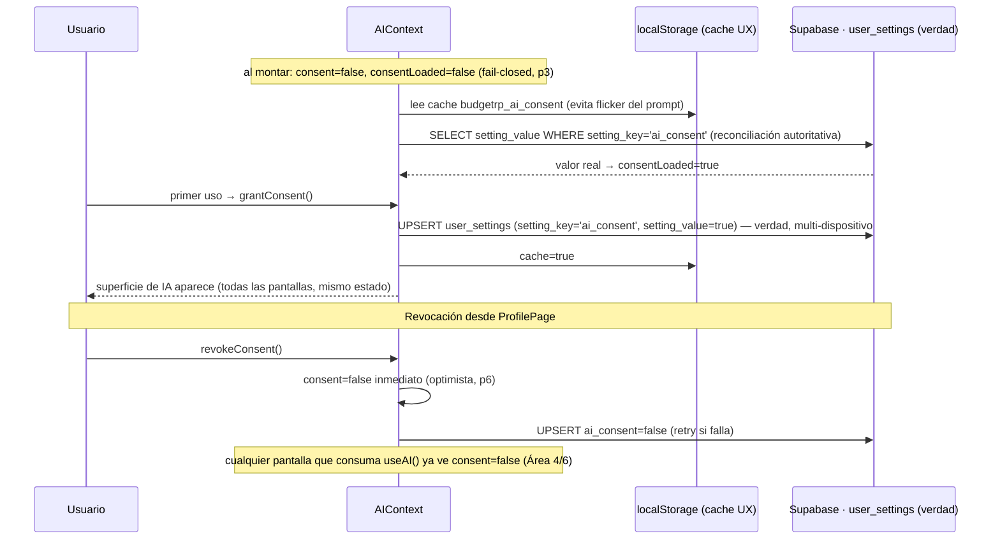

# Design: `insights-ia-real` — Diseño técnico del MVP de IA real

**Fase**: sdd-design (el "cómo" — contrato técnico antes de implementar; NO código de implementación)
**Fecha**: 2026-07-14
**Insumos**: `proposal.md` (10 decisiones aprobadas), `spec.md` (33 Requirements, 11 Áreas), `explore.md` (hechos verificados).
**Revisión del PO (post-diseño)**: 4 decisiones de arquitectura incorporadas — (1) catálogo de capacidades de IA en un módulo compartido único `shared/aiCapabilities.js` (cierra ex-R3); (2) consentimiento en tabla `user_settings` clave-valor, no en `subscriptions`; (3) AIProvider Interface que oculta a Groq del dominio; (4) Principio 8 + descarte de respuestas de IA tardías tras el guardado.
**Enmienda post-aprobación (2026-07-14, hallazgo de sdd-tasks)**: al verificar el código real durante sdd-tasks se detectó una segunda ruta de salida a Groq no contemplada en la §6 original — la categorización **en lote** de importación (`ImportManager.jsx:204` → `categorizeTransactionsFull` → `aiService.js` → `bulkCategorizeTransactions` → Groq), distinta de `SmartCategorySelector`/`suggestCategory`. Por decisión explícita del PO, este documento se **enmienda** (no se reescribe) para gatearla y quedar completo por sí solo; toca §2, §6, §9, §13 y §15. No reabre los 8 principios ni las 10 decisiones previas.
**Stack**: React 19.1 + Vite 5.4 + Tailwind 3.4 + Supabase + Netlify Functions · Vitest 4 · `strict_tdd: true`.
**Reglas del proyecto (`rules.design`)**: diagramas de secuencia para flujos de IA/Supabase; toda decisión con justificación.

---

## Arquitectura de confianza (restricciones inviolables)

Estos 8 principios NO son sugerencias: son el filtro contra el que se valida cada decisión posterior de este
documento. Ninguna implementación futura de este cambio puede romperlos. Cada Área técnica de abajo se traza a
uno o más con la notación `(principio N)`.

### Principio 1 — Nunca fabricar conocimiento

**Enunciado**: la IA solo muestra un resultado cuando tiene una señal genuina que sostenerlo; ante datos
insuficientes o sin patrón, se abstiene.
**Por qué es innegociable**: `spec.md` Área 1 lo eleva a Requirement con escenarios de abstención explícitos
("umbral cumplido pero sin patrón genuino → el sistema se abstiene"), derivado de `proposal.md` Decisión 1 y de
cap 03 regla 4 ("no inventar un patrón que los datos no sostienen"). Fabricar un aviso falso es exactamente la
ansiedad que Saldo existe para bajar (cap 01).
**Patrón que lo garantiza**: la elegibilidad y la abstención viven en **una función pura**
(`evaluateIdeaEligibility`) que puede devolver `{ eligible: false }` o `{ show: false }` como resultado
*válido y esperado*, nunca un error a corregir. La ausencia de resultado es un estado de primera clase del
contrato, no un `null` accidental.

### Principio 2 — Nunca ocultar cuándo interviene la IA

**Enunciado**: toda sugerencia de IA se presenta rotulada como tal y como propuesta, nunca como un hecho ya
aplicado ni disfrazada de dato del sistema.
**Por qué es innegociable**: `spec.md` Área 3 ("la sugerencia se confirma o se corrige — nunca se aplica en
silencio") y Área 2 (retiro del bot falso, que *simula* ser IA sin serlo — la mentira que originó este cambio).
La honestidad sobre la autoría es el núcleo del hallazgo de auditoría.
**Patrón que lo garantiza**: el contrato de `SmartCategorySelector` recibe `suggestedCategory` como objeto
separado del `selectedCategory` confirmado; la categoría guardada SIEMPRE proviene de una acción explícita del
usuario (`onCategoryChange`), nunca de un efecto que escriba el valor sugerido sin toque.

### Principio 3 — Nunca enviar más datos de los estrictamente necesarios

**Enunciado**: cada flujo envía el mínimo dato que *es* la señal; todo lo demás se agrega o se queda en el
dispositivo.
**Por qué es innegociable**: `spec.md` Área 7 fija payload por flujo (categorización = solo la descripción;
análisis = agregados por categoría). `explore.md` §4 verificó que hoy 4 de 6 flujos vuelcan transacciones
completas con PII a un tercero (Groq) sin consentimiento. Rosa teme "quedar expuesta" (cap 02).
**Patrón que lo garantiza**: un **único gateway de salida** (`AIContext`) es el único módulo que puede llamar al
proxy; cada método arma su payload mínimo y no acepta el objeto transacción crudo. Ningún componente importa
`callAI` directamente.

### Principio 4 — Nunca bloquear un flujo principal porque la IA falle

**Enunciado**: cargar, editar y ver movimientos, importar CSV y navegar funcionan igual con la IA caída,
ausente o denegada.
**Por qué es innegociable**: `spec.md` Área 3 ("sin sugerencia, el selector manual sigue siendo el camino
completo"), Área 5 caso 4 ("el resto de la app sigue funcionando"), Área 6 ("sin consentimiento, el flujo
central sigue entero").
**Patrón que lo garantiza**: la IA es una **capa aditiva sobre un flujo manual que ya existe y es completo**
(`BudgetForm` + `EXPENSE_CATEGORIES`, `categorizationEngine.js`). La sugerencia se monta *junto a*, nunca *en
lugar de*, el `<Select>` manual.

### Principio 5 — Toda función con IA debe tener un camino manual equivalente

**Enunciado**: cada punta de IA duplica una capacidad que el usuario ya puede ejercer a mano.
**Por qué es innegociable**: `spec.md` Área 3 y Área 10 (precondición (b): sin la sugerencia el guardado no se
bloquea). Es la contracara operativa del principio 4.
**Patrón que lo garantiza**: categorización asistida ↔ `<Select>` manual de categorías; mapeo CSV asistido ↔
`findColumnIndices` + mapeo manual (`ImportManager` ya tiene modos `template|profile|pattern|manual`). El camino
manual es el default; la IA es el atajo opcional.

### Principio 6 — Los errores de IA degradan la experiencia, nunca la bloquean

**Enunciado**: todo error de IA (proveedor caído, rate limit, sin plan, sin consentimiento) se traduce a un
estado calmo y a la caída al camino manual, jamás a una excepción sin manejar ni a UI rota.
**Por qué es innegociable**: `spec.md` Área 5 mapea 4 casos, cada uno con copy y comportamiento propios y sin
jerga técnica.
**Patrón que lo garantiza**: **todo path de IA envuelve su llamada en un `try/catch` en el gateway que degrada a
un estado tipado** (`{ status: 'provider_error' | 'rate_limited' | ... }`), nunca deja una promesa sin manejar y
nunca propaga el error crudo al render. El componente consume el estado, no la excepción.

### Principio 7 — La monetización habilita capacidades, pero nunca altera la honestidad de las respuestas

**Enunciado**: el plan decide *si* una función de IA está disponible, jamás *qué tan cierta* es la respuesta ni
si se fabrica un resultado para justificar el pago.
**Por qué es innegociable**: `proposal.md` Decisión 6 (IA como diferenciador pago) + `spec.md` Área 8. El gate es
una frontera de acceso, no un modulador de contenido. Un usuario pago recibe la misma abstención honesta
(principio 1) que recibiría si el hallazgo no existe.
**Patrón que lo garantiza**: el gate (`hasFeature`) es una **guarda booleana previa** a la ejecución
(`if (!canUseAI) return upsellState`), completamente separada de la lógica que genera o abstiene el resultado.
Nunca hay una rama "como es pago, mostremos algo igual".

### Principio 8 — La IA nunca modifica datos persistentes sin una acción explícita del usuario

**Enunciado**: ninguna respuesta de IA escribe, altera ni reabre un dato ya guardado por su cuenta; la
persistencia es siempre consecuencia de una acción explícita de la persona, nunca de la llegada de un resultado
del modelo.
**Por qué es innegociable**: `spec.md` Área 3 fija que "la categoría final del movimiento MUST ser siempre la
que el usuario confirmó o eligió — nunca una que la IA aplicó sin intervención humana", y que la sugerencia se
presenta como propuesta, "nunca se aplica en silencio". Es la contracara de escritura del principio 2 (que
gobierna la *presentación*): el 8 gobierna el *estado persistido*. Su aplicación concreta más importante es la
condición de carrera de la categorización asistida — el usuario guarda una categoría y **una respuesta tardía de
la IA para ese mismo movimiento llega después del guardado**; esa respuesta MUST descartarse, nunca sobrescribir
ni reabrir el movimiento ya confirmado (ver §3.1, caso de respuesta tardía, y §14 R2).
**Patrón que lo garantiza**: la sugerencia (`suggestedCategory`) y el valor confirmado (`selectedCategory`) son
piezas de estado distintas; **ningún efecto escribe jamás la sugerencia en persistencia** — el único camino de
escritura es la acción explícita del usuario (`onCategoryChange`/guardar). Por diseño estructural, una respuesta
de IA que resuelve tarde no tiene ningún path de código que la lleve al registro guardado. A eso se suma una
**guarda de sesión de borrador**: cada pedido de sugerencia se emite con un identificador de request y bajo un
`AbortController` ligado al ciclo de vida del borrador; al confirmar/guardar, el borrador pasa a estado
*committed* (o el `SmartCategorySelector` se desmonta) y toda respuesta que resuelva después se ignora —
descartada, no aplicada. La categoría guardada es intocable para cualquier respuesta que llegue después del
commit.

---

## 1. Arquitectura general

Se sigue el patrón **React Context API** ya establecido (`PeriodContext.jsx`, `CurrencyContext.jsx`): un
`createContext(null)`, un `Provider` con `value` memoizado, y un hook `useX()` que lanza si se usa fuera del
provider. No se reinventa nada.

Se introduce **`AIContext`** como la *entrada única* (Área 4). Es el único punto que conoce gate + consentimiento
+ estado de rate limit, y el único módulo autorizado a disparar salidas al proxy (principios 3, 6).

```
                         ┌───────────────────────── AIProvider (AIContext) ─────────────────────────┐
                         │  consentimiento · gate de plan · estado de límite · gateway de salida     │
   App.jsx ──wrap──────► │  useAI() → { suggestCategory, mapColumns, consent, ideaEligibility, ... } │
                         └───┬───────────────────────┬───────────────────────────┬──────────────────┘
                             │                       │                           │
                    BudgetForm/                ImportManager               ProfilePage
                 SmartCategorySelector      (mapeo CSV, migrado)      (toggle de consentimiento)
                             │                       │
                             └──────── gateway ──────┴──► AIProvider Interface  ← el dominio depende SOLO de esto
                                        │                 (categorize/generateIdea/predict/mapColumns)
                                        │                          │
                                        │                 groqProvider.js (implementa la interfaz:
                                        │                 arma prompts Groq, parsea su JSON) ──► /ai-proxy (Netlify)
                                        │                                                            │
                             categorizationEngine.js                                    Supabase (plan + consent + rate limit)
                             (camino manual/local, principio 5)
```

`AIProvider` se monta envolviendo el árbol autenticado en `App.jsx`, al mismo nivel que los providers existentes.
Los 5 componentes de `components/AI/` siguen siendo *presentacionales* (`explore.md` §6): reciben todo por props
desde consumidores de `useAI()`. Solo entra `SmartCategorySelector` (Área 1).

**Capa de abstracción de proveedor (principio 3, decisión de arquitectura)**: entre el gateway de `AIContext` y
la implementación Groq se interpone una **AIProvider Interface** (§4). El dominio de Saldo (`AIContext`,
`ideaEligibility`, cualquier consumidor) depende **exclusivamente** de esa interfaz, expresada en términos de
*capacidades* (`categorize`, `generateIdea`, `predict`, `mapColumns`), nunca de Groq. La implementación concreta
—armado del prompt Groq, parseo de su JSON, llamada HTTP al proxy— vive detrás de la interfaz en
`groqProvider.js` (el actual `ai-providers.js` refactorizado a implementación). Cambiar de proveedor en el futuro
es escribir otra implementación de la misma interfaz; ningún módulo de dominio se toca. **Alcance decidido:** la
abstracción es **del lado cliente** (donde hoy vive la especificidad de Groq: prompts y parseo, `explore.md` §4).
El `ai-proxy.js` server-side es, por definición, el adaptador de integración con el proveedor (posee la API key y
el `callGroq`): que "conozca" Groq es su rol legítimo de frontera, no una fuga hacia el dominio. Aislar también
el proxy de Groq es una extensión separable y no requerida por este pedido (el campo `provider` del proxy ya
anticipa multi-proveedor); no se agranda el alcance más allá de lo pedido.

## 2. Responsabilidades de cada módulo

| Módulo | Responsabilidad | Área / principio |
|---|---|---|
| `src/contexts/AIContext.jsx` (nuevo) | Entrada única: expone estado y gateway; único punto de gate+consentimiento+límite; depende de la AIProvider Interface, no de Groq | 4, 6, 8 / p3,6,7,8 |
| `shared/aiCapabilities.js` (nuevo, carpeta neutral raíz) | **Fuente única del catálogo capacidad→planes** de IA; consumido por cliente y servidor sin duplicar (ver §9) | 8 / p7 |
| `src/config/aiInsights.js` (nuevo) | Fuente única de parámetros de producto: `MIN_CATEGORIZED_EXPENSES=20`, `MIN_HISTORY_DAYS=28`, `EXCLUDED_CATEGORY='Otros'` | 1 / p1 |
| `src/lib/ideaEligibility.js` (nuevo) | Función pura umbral + abstención de "Una idea sobre tu plata" | 1 / p1 |
| `src/lib/aiConfidence.js` (nuevo) | Fuente única del mapeo numérico→etiqueta de confianza (`toConfidenceLabel`) | 10 / p2 |
| `src/lib/aiProvider.js` (nuevo, contrato) | **AIProvider Interface**: define las capacidades (`categorize`/`generateIdea`/`predict`/`mapColumns`) de las que depende el dominio; oculta al proveedor | 7 / p3 |
| `src/lib/groqProvider.js` (= `ai-providers.js` refactorizado) | **Implementación Groq** de la interfaz: arma prompts Groq, parsea su JSON, llama al proxy; `categorize` devuelve etiqueta; deja de exponer cifra de límite propia | 7, 9, 10 / p3 |
| `netlify/functions/ai-proxy.js` (mod) | Verdad de rate limit (10/min) **y** enforcement server-side del plan; importa `shared/aiCapabilities.js` para el gate 403 | 8, 9 / p7 |
| `src/hooks/useAIInsightsMulti.js` (mod→interno) | Se repliega detrás de `AIContext`; deja de instanciarse suelto en componentes | 4 |
| `categorizationEngine.js` (parcialmente tocado) | `suggestExpenseCategory` (sugerencia local instantánea, sin red) queda **intacta** — camino manual, convive como fallback. Pero `categorizeTransactionsFull` (usada en `ImportManager.jsx:204`) SÍ depende de la cadena de Groq (vía `aiService.js`) y por eso su ruta de IA en lote necesita el gate de §6 | p4,5 (`suggestExpenseCategory`); 6,8 / p7 (`categorizeTransactionsFull`) |
| `src/services/aiService.js` (mod) | Capa que envuelve `bulkCategorizeTransactions` (`groqProvider.js`) para la categorización en lote de importación; era la ruta a Groq no mapeada por el diseño original. Pasa a consumirse **condicionalmente detrás del gate** (`canUseAI`/`hasConsent` de `useAI()`, §6) | 6,8 / p7 |

**El "20" configurable en un solo lugar** (Área 1, exigido explícitamente): vive en `config/aiInsights.js`.
`ideaEligibility.js` lo importa; ningún otro archivo repite el literal. Recalibrar a 15/25 es cambiar una línea
de config, sin tocar arquitectura (Requirement Área 1).

## 3. Flujo completo de datos

### 3.1 Categorización asistida (descripción → sugerencia o abstención)

```mermaid
sequenceDiagram
    participant U as Usuario
    participant SCS as SmartCategorySelector
    participant AC as AIContext (gateway)
    participant PV as AIProvider Interface (groqProvider)
    participant PX as /ai-proxy (Netlify)
    participant SB as Supabase
    participant GQ as Groq

    Note over SCS: sugerencia LOCAL instantánea (categorizationEngine, sin red) se muestra primero (p4, R2)
    U->>SCS: escribe descripción (>=3 chars)
    Note over SCS: debounce 800ms
    SCS->>AC: suggestCategory(description) · requestId + AbortController (draft)
    AC->>AC: assertOutboundAllowed()
    alt sin consentimiento (p3)
        AC-->>SCS: {status:'no_consent'} → pide consentimiento just-in-time
        U->>AC: "Activar" / "Ahora no"
    end
    alt plan free (p7, Área 8)
        AC-->>SCS: {status:'no_plan'} (upsell) — NO hay salida de red
    end
    Note over AC,PV: el dominio depende de la capacidad categorize(), no de Groq (p3)
    AC->>PV: categorize(description)
    PV->>PX: POST {prompt: solo descripción} (p3, Área 7)
    PX->>SB: auth + plan_type ∈ catálogo compartido (enforcement server, Área 8)
    PX->>PX: rate limit 10/min (Área 9)
    alt 429 / 503 (p6)
        PX-->>PV: error
        PV-->>AC: {status:'rate_limited'|'provider_error'}
        AC-->>SCS: estado calmo; selector manual sigue (p4)
    else ok
        PX->>GQ: prompt
        GQ-->>PX: {categoria, confianza:0.95}
        PX-->>PV: result crudo Groq
        PV->>PV: parsea JSON Groq → {category, confidence:0.95}
        AC->>AC: toConfidenceLabel(0.95) → 'alta' (Área 10)
    end
    alt draft NO commiteado y requestId es el vigente
        AC-->>SCS: {category, confidence:'alta'} | null si fuera de rango
        U->>SCS: confirma (1 toque) o corrige manual (p2)
        SCS->>U: categoría final = la que el usuario confirmó
    else RESPUESTA TARDÍA: el usuario ya guardó ese movimiento (p8)
        Note over AC,SCS: draft.committed === true (o SCS desmontado / request abortado)
        AC->>AC: descarta la respuesta — NO reabre ni reescribe el movimiento guardado
        Note over SCS: la categoría persistida sigue siendo la que el usuario confirmó (p8, Área 3)
    end
```

### 3.2 Consentimiento (primer pedido → efecto inmediato en todas las pantallas)



## 4. Contratos entre componentes (interfaces)

```typescript
// shared/aiCapabilities.js — FUENTE ÚNICA del catálogo capacidad→planes (§9, resuelve ex-R3)
// Carpeta neutral en la RAÍZ del repo (fuera de src/ y de netlify/): módulo ESM plano,
// SIN import.meta.env, SIN React, SIN deps de framework → importable por AMBOS lados:
//   cliente:  import { AI_CAPABILITIES, planHasCapability } from '../../shared/aiCapabilities';  (Vite/Rollup lo bundlea)
//   servidor: import { AI_CAPABILITIES, planHasCapability } from '../../shared/aiCapabilities';  (esbuild de Netlify lo bundlea)
export const AI_PLANS_WITH_AI = ['pro_monthly', 'pro_yearly', 'lifetime']; // paridad con useSubscription.js:102-104
export const AI_CAPABILITIES = {
  // capacidad de dominio → feature de plan que la habilita (nombres ya usados en useSubscription)
  assisted_categorization: { feature: 'ai_analysis',    plans: AI_PLANS_WITH_AI }, // MVP visible
  spending_idea:           { feature: 'ai_analysis',    plans: AI_PLANS_WITH_AI }, // "Una idea sobre tu plata"
  future_glimpse:          { feature: 'ai_predictions', plans: AI_PLANS_WITH_AI }, // mirada a futuro
  csv_column_mapping:      { feature: 'ai_analysis',    plans: AI_PLANS_WITH_AI }, // mapeo import
};
/** @returns {boolean} true si el planType incluye la capacidad. Misma verdad en cliente y servidor. */
export function planHasCapability(planType, capability) // AI_CAPABILITIES[capability]?.plans.includes(planType)

// src/lib/aiProvider.js — AIProvider Interface (contrato): el dominio depende SOLO de esto, nunca de Groq (p3)
interface AIProvider {
  categorize(description: string): Promise<{ category: string, confidence: number } | null>; // categorización asistida
  generateIdea(aggregates: CategoryAggregate[]): Promise<Idea | null>;   // "Una idea sobre tu plata" (abstención = null, p1)
  predict(aggregates: CategoryAggregate[]): Promise<Prediction | null>;  // mirada a futuro
  mapColumns(headers: string[], sampleRows: string[][]): Promise<ColumnMap>; // mapeo CSV import
}
// src/lib/groqProvider.js implementa AIProvider: arma prompts Groq + parsea su JSON + llama al proxy.
// Sustituir Groq = escribir otra implementación de AIProvider; AIContext y el dominio NO se tocan.

// src/config/aiInsights.js — FUENTE ÚNICA de parámetros de producto (Área 1)
export const AI_IDEA = {
  MIN_CATEGORIZED_EXPENSES: 20,   // configurable; excluye "Otros"
  MIN_HISTORY_DAYS: 28,
  EXCLUDED_CATEGORY: 'Otros',
};

// src/lib/aiConfidence.js — FUENTE ÚNICA del fix de shape (Área 10, p2)
/** @param {number} n 0..1 @returns {'alta'|'media'|'baja'|null} null = no mostrar (p1) */
export function toConfidenceLabel(n) // >=0.8 'alta'; >=0.5 'media'; >0 'baja'; else null

// src/lib/ideaEligibility.js — función pura, testeable sin red (Área 1, p1)
/** @returns {{ eligible:boolean, reason?:string }} */
export function evaluateIdeaEligibility(expenses, firstTxDate, now, config = AI_IDEA)

// src/contexts/AIContext.jsx — ENTRADA ÚNICA (Área 4)
interface AIState {
  hasConsent: boolean;
  consentLoaded: boolean;                 // true solo tras reconciliar con Supabase (p3)
  canUseAI: boolean;                       // gate cliente: hasFeature('ai_analysis') (UX)
  status: 'idle'|'loading'|'no_consent'|'no_plan'|'rate_limited'|'provider_error';
}
interface AIApi extends AIState {
  // Único path de salida sancionado. NO expone callAI ni cifra de rate limit.
  suggestCategory(description: string): Promise<{category:string, confidence:'alta'|'media'|'baja'} | null>;
  mapColumns(headers: string[], sampleRows: string[][]): Promise<ColumnMap>;   // migración ImportManager
  grantConsent(): Promise<void>;
  revokeConsent(): Promise<void>;          // inmediato, sin justificación (Área 6)
  ideaEligibility(expenses, firstTxDate): { eligible: boolean };
}
export const useAI = (): AIApi   // lanza fuera de AIProvider (patrón usePeriod)
```

**Fix del shape mismatch (Área 10, deuda bloqueante)**: hoy `suggestCategory()` en `ai-providers.js:216-219`
devuelve `confidence` como número (`data.confianza`). El gateway lo pasa por `toConfidenceLabel()` **en un solo
lugar** antes de entregárselo al componente. Si el número cae fuera de rango o el parseo falla → devuelve `null`
→ `SmartCategorySelector` trata la sugerencia como no disponible (nunca la muestra rota, Área 10 Requirement).
`SmartCategorySelector.propTypes` ya declara `oneOf(['alta','media','baja'])`: el contrato queda satisfecho sin
tocar el componente presentacional.

## 5. Puntos de integración

`SmartCategorySelector` se monta dentro de **`BudgetForm.jsx`**, reemplazando el `<Select id="budget-category">`
(líneas 237-246) cuando `activeType === 'expense'`. El `<Select>` manual pasa a ser el fallback interno del
propio `SmartCategorySelector` (que ya lo incluye, líneas 147-167) — el camino manual nunca desaparece
(principios 4, 5). `BudgetForm` alimenta `onGetSuggestion={ai.suggestCategory}`, `suggestedCategory` y `loading`
desde `useAI()`. El gate y el consentimiento se consultan vía `useAI()` sin fricción: si `!canUseAI` o
`!hasConsent`, `BudgetForm` simplemente no pasa la sugerencia y muestra el `<Select>` de siempre (Área 5 casos
1/3). Categorías desde `EXPENSE_CATEGORIES` (ya usado en `BudgetForm:107`).

## 6. Estrategia de migración

- **`ImportManager.jsx:138`** (`useAIInsights([])` → `aiInsights.mapImportColumns`, usado en el mapeo CSV): se
  reemplaza por `const ai = useAI()` y `ai.mapColumns(...)`. La firma de salida (`columnMap`) se conserva
  idéntica para no romper el pipeline `Parser → Header → Mapping → Normalization` ya funcional. El mapeo por IA
  pasa a estar gateado por consentimiento+plan; si se deniega, `ImportManager` **cae a sus modos no-IA ya
  existentes** (`template|profile|pattern|manual`) — compatibilidad hacia atrás preservada (principios 4, 5).
- **`ImportManager.jsx:204`** (`categorizeTransactionsFull` → `aiService.js` → `bulkCategorizeTransactions` →
  Groq, categorización **en lote** de las filas importadas): es una **segunda ruta de salida a Groq**, distinta
  de la de `SmartCategorySelector`/`suggestCategory` (arriba) y verificada en el código durante sdd-tasks. Hoy no
  pasa por ningún gate. **Por qué necesita gate**: Área 6 (ningún dato viaja al proveedor sin consentimiento
  activo) y Área 8 (ninguna función de IA se ejecuta sin pasar el gate de plan) son garantías duras **sin
  excepciones por tipo de flujo**; una salida a Groq no gateada las violaría igual que cualquier otra. **Cómo se
  resuelve**: se consulta `canUseAI`/`hasConsent` de `useAI()` —los mismos que ya expone `AIContext` por diseño,
  sin inventar arquitectura nueva— **antes** de invocar el paso de IA en lote; sin acceso, la categorización cae a
  las reglas locales (`categorizeWithRules`) y al fallback `'Otros'` ya existente en el propio motor. El pipeline
  de importación **no se bloquea** en ningún caso: las filas se categorizan localmente y la importación completa
  con normalidad (principios 4 y 5). El gate es una guarda booleana previa (principio 7), separada de la lógica de
  categorización; no duplica el mecanismo del gateway, reutiliza el mismo estado de `AIContext`.
- **`App.jsx:125`** (`useAIInsights(allTransactions)` con resultado descartado): se elimina; el estado ahora vive
  en `AIProvider`.
- **`FloatingChatWidget` (bot falso)**: **borrado directo, sin flag ni estado transicional**. Es una mentira de
  producto (principio 2, Área 2); un flag prolongaría la deshonestidad. Se retira el mount `App.jsx:266-267` y
  los imports `App.jsx:29-30`; se eliminan `FloatingChatWidget.jsx` y `FloatingChatButton.jsx`. Su estado de
  mensajes es efímero (in-memory, `useState`) — no hay dato persistido que migrar.

## 7. Manejo de errores — 4 casos de Área 5 (todos trazan a principio 6)

| Caso Área 5 | Disparador técnico | Estado del gateway | Componente de fallback |
|---|---|---|---|
| 1. Plan free | `!hasFeature('ai_analysis')` (cliente) + 403 del proxy | `status:'no_plan'` | Upsell inline; `<Select>` manual activo |
| 2. Límite alcanzado | `fetch` responde **429** | `status:'rate_limited'` | Copy de espera (sin cifra); manual activo |
| 3. Deshabilitada/sin consentimiento | `!hasConsent` (corto-circuito, sin red) | `status:'no_consent'` | Superficie IA ausente; manual intacto |
| 4. Error del proveedor | `fetch` responde **503** o red falla | `status:'provider_error'` | Copy calmo de reintento; resto de la app intacto |

Todos: el gateway envuelve la llamada en `try/catch`, mapea a un `status` tipado y **nunca** propaga la excepción
al render ni deja la promesa sin manejar (principio 6). El componente lee `status`, no atrapa errores.

## 8. Privacidad

- **Persistencia del consentimiento → Supabase, tabla `user_settings` (verdad); localStorage (cache de UX)**.
  Justificación: el consentimiento es una decisión de la *persona*, no del *dispositivo*; debe viajar entre
  dispositivos y respetarse una revocación hecha en otro (Área 6). localStorage (`budgetrp_ai_consent`) solo
  evita el *flicker del prompt* al montar; **jamás** es autoritativo para permitir una salida.
- **Decisión de esquema — tabla `user_settings` clave-valor, NO una columna en `subscriptions`** (decisión de
  arquitectura del PO): el consentimiento de IA es una **preferencia del usuario**, un dominio distinto al de la
  *suscripción* (plan/pago/Stripe). Mezclarlo en `subscriptions` acoplaría dos dominios que evolucionan por
  separado y, sobre todo, obligaría a una migración de columna por **cada** preferencia futura del producto. Se
  elige un esquema **clave-valor extensible** que absorbe preferencias futuras sin DDL nuevo por cada una:

```sql
-- Tabla user_settings — preferencias del usuario (extensible, una fila por (user_id, setting_key))
CREATE TABLE IF NOT EXISTS public.user_settings (
  id UUID PRIMARY KEY DEFAULT gen_random_uuid(),
  user_id UUID NOT NULL REFERENCES auth.users(id) ON DELETE CASCADE,
  setting_key   TEXT  NOT NULL,           -- ej. 'ai_consent'  (futuras: sin columna nueva)
  setting_value JSONB NOT NULL,           -- JSONB: absorbe boolean/string/objeto sin cambiar el esquema
  updated_at TIMESTAMPTZ NOT NULL DEFAULT NOW(),
  UNIQUE (user_id, setting_key)           -- 1 valor por preferencia por usuario → UPSERT idempotente
);
CREATE INDEX IF NOT EXISTS idx_user_settings_user_id ON public.user_settings(user_id);
ALTER TABLE public.user_settings ENABLE ROW LEVEL SECURITY;
-- A diferencia de subscriptions (UPDATE bloqueado, cambia solo vía webhook), user_settings ES dato propio
-- del usuario: se permite SELECT/INSERT/UPDATE por dueño (patrón de public.transactions), auth.uid()=user_id.
CREATE POLICY "own_settings_select" ON public.user_settings FOR SELECT USING (auth.uid() = user_id);
CREATE POLICY "own_settings_insert" ON public.user_settings FOR INSERT WITH CHECK (auth.uid() = user_id);
CREATE POLICY "own_settings_update" ON public.user_settings FOR UPDATE USING (auth.uid() = user_id) WITH CHECK (auth.uid() = user_id);
-- Reutiliza el trigger update_updated_at_column() ya definido en el repo (subscriptions/transactions).
CREATE TRIGGER set_user_settings_updated_at BEFORE UPDATE ON public.user_settings
  FOR EACH ROW EXECUTE FUNCTION update_updated_at_column();
```

  Convención seguida (igual que `supabase/subscriptions-schema.sql`): `gen_random_uuid()`, FK a `auth.users` con
  `ON DELETE CASCADE`, RLS habilitada, índice por `user_id`, trigger `update_updated_at_column()` compartido, y un
  archivo `supabase/user-settings-schema.sql` a crear en sdd-apply siguiendo ese patrón (aquí solo el contrato).
  `grantConsent()`/`revokeConsent()` hacen UPSERT sobre `(user_id, 'ai_consent')`; el flag existe como fila, no
  como columna — cualquier preferencia futura (tema, notificaciones, etc.) reutiliza la misma tabla.
- **"Cero llamadas salientes sin consentimiento" en UN solo punto de control** (Área 6, no N call-sites
  disciplinados): el gateway de `AIContext` es el único módulo que puede llamar al proxy. Cada método invoca
  primero `assertOutboundAllowed()`, que exige `hasConsent === true && consentLoaded === true` (fail-closed:
  hasta reconciliar con Supabase, se niega). Estructuralmente: `callAI`/`callViaProxy` de `ai-providers.js` dejan
  de importarse en componentes; su uso directo se considera violación de contrato (verificable en test/lint).
  Un desarrollador futuro que agregue una punta de IA *tiene* que pasar por el gateway — no hay otra puerta.

## 9. Enforcement de monetización

`explore.md` §5 verificó que hoy el gate es "solo autenticación en el proxy": editar el estado de React
bypassearía cualquier check de plan puramente cliente. Diseño de doble capa:

- **Cliente (UX, no confiable)**: `AIContext.canUseAI = planHasCapability(planType, 'assisted_categorization')`
  decide si mostrar la superficie o el upsell (Área 5 caso 1). Es cosmético.
- **Servidor (enforcement real, no bypasseable)**: `ai-proxy.js`, tras `authenticateRequest`, hace **una consulta
  a `subscriptions`** por `user.id` y rechaza con **403** si el `plan_type` no habilita la capacidad. Así, aunque
  el cliente fuerce el estado, el proxy no ejecuta la llamada a Groq para un plan sin acceso (Área 8, principio 7).
- **Catálogo de capacidades en un único módulo compartido (resuelve la ex-R3, decisión de arquitectura del PO)**:
  la *autorización* sigue siendo del servidor (nadie bypasea editando estado de React — eso no cambia), pero la
  *definición* de qué capacidades de IA existen y qué planes las habilitan **vive una sola vez** en
  `shared/aiCapabilities.js` (§4). El cliente la importa para la UX cosmética (`canUseAI`); el servidor
  (`ai-proxy.js`) la importa para el enforcement real (403). El archivo está en una **carpeta neutral `shared/` en
  la raíz del repo** —fuera de `src/` (código de cliente que Vite bundlea con `import.meta.env`) y fuera de
  `netlify/functions/` (Node/esbuild)— y es ESM plano sin dependencias de framework, por lo que ambos lados lo
  importan por ruta relativa (`../../shared/aiCapabilities`) y sus bundlers respectivos (Rollup en cliente, esbuild
  de Netlify en servidor) lo incorporan **sin duplicar el archivo**. Ya no existe una segunda tabla de features
  que pueda derivar de `useSubscription.js`: éste pasa a leer los planes del mismo catálogo. Una sola definición,
  consumida por los dos lados: la divergencia deja de ser posible por diseño.
- **Alcance del enforcement — "ninguna función de IA" incluye la categorización en lote de importación
  (Principio 7)**: el mismo principio (gate antes de *cualquier* llamada a Groq) aplica no solo al flujo de
  `AIContext.suggestCategory`, sino también a la ruta de categorización en lote de `ImportManager.jsx:204`
  (`categorizeTransactionsFull` → `aiService.js`, ver §6). No se duplica el mecanismo: esa ruta consulta el mismo
  `canUseAI`/`hasConsent` de `useAI()` antes de invocar el paso de IA en lote, y el servidor sigue siendo la
  autoridad (mismo 403 del proxy para un plan sin acceso). Se deja explícito para que "ninguna función de IA"
  (Área 8, Principio 7) se lea sin ambigüedad: cubre **toda** salida a Groq, sin excepción por tipo de flujo.

## 10. Rate limiting — fuente única

- **El servidor es la verdad (10/min, `ai-proxy.js:26`)**. El cliente **no** replica el número.
- El estado "límite alcanzado" (Área 5 caso 2) se deriva **exclusivamente de recibir un 429** del proxy, no de un
  contador cliente. Se **elimina la cifra divergente** `MAX_REQUESTS_PER_MINUTE=20` de `ai-providers.js:35` como
  fuente de comportamiento; si se conserva un debounce anti-spam, no expone ningún número ni promete un límite.
- La UI **nunca muestra "req/min"** (Área 9, se retira junto con `AIProviderStatus`, excluido). Rosa ve el copy
  humano del caso 2, jamás una cifra. Una sola definición (server) gobierna; nada en el cliente puede
  desincronizarse porque el cliente ya no tiene número propio.

## 11. Observabilidad

Se registra vía el `logger` existente, con **solo metadatos, nunca contenido** (principio 3):

| Evento | Campos permitidos | Prohibido |
|---|---|---|
| Abstención de "Una idea" | `{ event:'idea_abstained', reason }` | descripciones, montos |
| Error de proveedor | `{ event:'ai_provider_error', kind }` | payload, PII |
| Uso del gate | `{ event:'ai_gate_hit', plan:'free' }` | identidad más allá del plan |
| Rate limit | `{ event:'ai_rate_limited' }` | — |

El servidor ya sigue este patrón (`ai-proxy.js:244` loguea `groq_failed` con `userId` y `error.message`, sin
contenido de transacción). Nunca se loguea la descripción ni el prompt.

## 12. Estrategia de pruebas (strict TDD — red antes de implementar)

| Capa | Qué se testea | Herramienta |
|---|---|---|
| Unit | `evaluateIdeaEligibility` (20/28/"Otros", abstención) — cubre todos los escenarios de Área 1 | Vitest |
| Unit | `toConfidenceLabel` (rangos, fuera-de-rango→null) — Área 10 | Vitest |
| Unit | `assertOutboundAllowed` (fail-closed: sin consent/plan/loaded → deniega) — Área 6/8 | Vitest |
| Unit (server) | `ai-proxy` enforcement de plan (403) + rate limit (429) — usa `__private` existente | Vitest |
| Unit (compartido) | `planHasCapability` de `shared/aiCapabilities.js`: free sin acceso, pro/lifetime con acceso — mismo módulo que consumen cliente y servidor (ex-R3) | Vitest |
| Unit | Guarda de sesión de borrador: respuesta de IA que resuelve tras `committed`/abort → descartada, no aplicada (Área 3, p8) | Vitest |
| Componente | `SmartCategorySelector`: confianza válida vs. rota; confirmar/corregir (Área 3, 10) | @testing-library/react |
| Componente | Carrera: usuario guarda antes de que llegue la sugerencia; la respuesta tardía NO reabre ni cambia la categoría guardada (Área 3, p8) | @testing-library/react |
| Componente | Flujo de consentimiento: primer pedido, revocación, efecto en pantalla (Área 6) | @testing-library/react |
| Componente | 4 casos de error (Área 5): cada `status` renderiza su fallback; manual siempre funciona | @testing-library/react |
| Componente | Ausencia total de `FloatingChatWidget` y de superficies excluidas (Área 1, 2) | @testing-library/react |
| Fuera de alcance automatizado | Verificación de copy/tono (sin jerga, calma) — revisión manual, como en cambios previos | manual |

Cada Requirement con umbral objetivo (Área 1) o mapeo (Área 10) se cubre con test unitario sobre función pura;
los estados de UI (Áreas 3, 5, 6) con `@testing-library/react`.

## 13. Compatibilidad hacia atrás

- **Importación CSV**: la firma `mapColumns → columnMap` se preserva; los modos no-IA de `ImportManager` siguen
  intactos. No se rompe el pipeline existente. Además, el pipeline completo de importación
  (`Parser → Header → Mapping → Normalization → Categorización`) **sigue funcionando sin acceso a IA**: cuando
  falta consentimiento o plan, la categorización en lote (`ImportManager.jsx:204`, ver §6) cae a las reglas
  locales y al fallback `'Otros'`, y la importación completa igual — **nunca se bloquea** por ausencia de IA
  (principios 4, 5).
- **Estado persistido previo**: `useAIInsights` escribe `localStorage['lastAnalysis']` (`useAIInsightsMulti.js:95`).
  No hay flag de consentimiento previo ni estado de IA huérfano que migrar; `lastAnalysis` puede quedar como dato
  muerto inocuo o limpiarse. `FloatingChatWidget` no persiste nada.
- **Nueva tabla `user_settings`**: es aditiva (no altera `subscriptions` ni ninguna tabla existente). No hay
  consentimiento previo persistido que migrar: la ausencia de fila `(user_id, 'ai_consent')` se interpreta como
  *sin consentimiento* (fail-closed, p3), coherente con el estado inicial del gateway. Ningún flujo previo
  dependía de esta tabla, así que su introducción no rompe nada.
- **Keys de localStorage**: se respeta el prefijo `budgetrp_` (nuevo `budgetrp_ai_consent`).

## 14. Riesgos (técnicos)

- **R1 — Carrera consentimiento/primera llamada**: entre montaje y reconciliación con Supabase, un cache stale
  `true` podría permitir una salida indebida. **Mitigado**: `assertOutboundAllowed` exige `consentLoaded===true`;
  el cache solo suprime el prompt, no habilita la red (fail-closed).
- **R2 — Latencia percibida y carrera con el guardado**: la sugerencia por IA (debounce 800ms + round-trip
  proxy→Groq) no es instantánea. **Mitigación**: mostrar primero la sugerencia local de
  `categorizationEngine.suggestExpenseCategory` (síncrona, sin red) y dejar que la IA la refine cuando llega; nunca
  un spinner que bloquee el campo. **Contracara (principio 8)**: como la IA refina *después*, el usuario puede
  confirmar y guardar antes de que la respuesta llegue. Esa respuesta tardía **MUST descartarse** — nunca
  sobrescribe la categoría ya guardada. Mecanismo: `requestId` + `AbortController` por sesión de borrador y una
  guarda `committed`; una respuesta que resuelve tras el commit (o tras el desmontaje del `SmartCategorySelector`)
  se ignora. Además, estructuralmente, ningún efecto escribe la sugerencia en persistencia (§3.1, Principio 8).
- **R3 — Revocación con Supabase caído**: `revokeConsent` debe cortar el acceso *ya* aunque la escritura remota
  falle. **Mitigación**: revocación optimista local inmediata + retry de la escritura (nunca esperar al server
  para dejar de mostrar IA).
- **R4 — Rate limit laxo sin Redis**: `explore.md` §3 documentó que el fallback en memoria se resetea por
  instancia serverless. Es un riesgo server preexistente; no bloquea el MVP, se hereda tal cual (Redis sigue
  siendo el camino recomendado).

## 15. Criterios de aceptación (listo para sdd-tasks)

- [ ] Existe un único `AIContext`; ningún componente importa `callAI`/`callViaProxy` directamente. (Área 4, p3)
- [ ] El literal `20` y `28` viven solo en `config/aiInsights.js`; `ideaEligibility` los importa. (Área 1)
- [ ] `evaluateIdeaEligibility` es pura y pasa todos los escenarios de Área 1 (19 no; 25-en-2-días no; 20-en-28
      sí; "Otros" excluido; abstención sin patrón). (Área 1, p1)
- [ ] `toConfidenceLabel` mapea número→etiqueta en un solo lugar; fuera de rango → `null` → no se muestra rota.
      (Área 10, p2)
- [ ] `SmartCategorySelector` montado en `BudgetForm`; el `<Select>` manual funciona siempre. (Área 3, p4/5)
- [ ] `ai-proxy.js` rechaza con 403 a un plan sin IA aun con estado cliente forzado. (Área 8, p7)
- [ ] El catálogo capacidad→planes vive UNA sola vez en `shared/aiCapabilities.js`; cliente (`canUseAI`) y
      servidor (403) lo importan; no hay segunda tabla de features que pueda divergir. (Área 8, p7, ex-R3)
- [ ] El consentimiento persiste en la tabla `user_settings` (clave-valor), no en `subscriptions`; UPSERT sobre
      `(user_id,'ai_consent')`; ausencia de fila = sin consentimiento (fail-closed). (Área 6, p3)
- [ ] El dominio (`AIContext`, consumidores) depende solo de la AIProvider Interface; ningún módulo de dominio
      importa Groq ni parsea su formato — eso vive en `groqProvider.js`. (p3)
- [ ] Una respuesta de IA que llega DESPUÉS de que el usuario guardó la categoría se descarta: no reabre ni
      reescribe el movimiento; la categoría persistida sigue siendo la confirmada. (Área 3, p8)
- [ ] El estado "límite alcanzado" se dispara solo por 429 del server; no hay cifra de límite en el cliente ni en
      la UI. (Área 9)
- [ ] `assertOutboundAllowed` niega toda salida sin `hasConsent && consentLoaded`; verificado con test. (Área 6, p3)
- [ ] Revocación desde `ProfilePage` corta la superficie de IA de inmediato en toda pantalla. (Área 6, Área 4)
- [ ] `FloatingChatWidget` y `FloatingChatButton` eliminados; sin rastro en ningún viewport. (Área 2, p2)
- [ ] `ImportManager` migrado a `useAI().mapColumns`; mapeo CSV existente no se rompe; cae a modos no-IA si se
      deniega. (Área 7, compat, p4/5)
- [ ] La categorización **en lote** de importación (`ImportManager.jsx:204` → `categorizeTransactionsFull` →
      `aiService.js` → Groq) está gateada: sin `canUseAI`/`hasConsent` no realiza ninguna salida a Groq y cae a
      reglas locales + `'Otros'` sin bloquear la importación. (Área 6, Área 8, p7, hallazgo sdd-tasks)
- [ ] Ninguna superficie excluida (score, nombre de modelo, req/min, chart de predicción, alertas) se renderiza.
      (Área 1)
- [ ] Observabilidad emite solo metadatos; ningún log contiene descripción/monto. (Área 11, p3)

## Open Questions

Ninguna. Las dos preguntas abiertas de la versión anterior quedaron **cerradas por decisión de arquitectura del
Product Owner** e integradas al cuerpo del diseño:

- **Catálogo de features IA cliente/servidor** (ex-R3): resuelto — módulo único compartido
  `shared/aiCapabilities.js` en carpeta neutral de la raíz, importado por ambos lados sin duplicar (§1, §4, §9).
  La autorización sigue siendo del servidor; solo la *definición* del catálogo se unifica.
- **Persistencia de `ai_consent`**: resuelto — tabla `user_settings` clave-valor extensible, **no** columna en
  `subscriptions` (dominios distintos; extensible a preferencias futuras sin DDL por preferencia) (§4, §8, §13).
